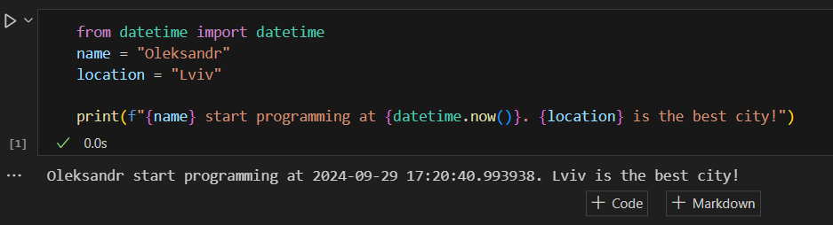
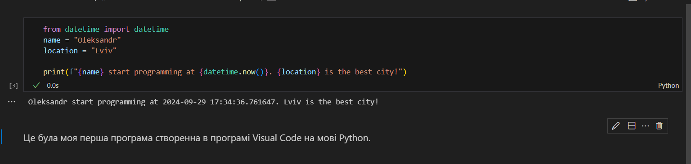
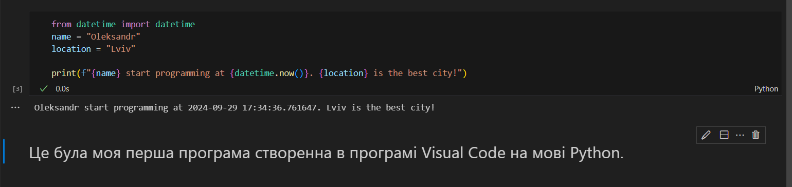

# Звіт до роботи
## Тема: Оформлення робіт та перша програма
### Мета роботи: Навчитись оформляти робіти та написати першу програму

---
### Виконання роботи
* Результати виконання завдання *1...N*;
    1. Інсталював Python, а також всі плагіни в Visual Code. Створив файл my_first_app.py, після чого скопіював код, який був вказаний в роботі.
    1. В терміналі вивело: "Oleksandr start programming at 2024-09-29 17:12:37.394045. Lviv is the best city!"
    1. Створив новий файл під назвою my_first_app.ipynb. Скопіював код та вставив в файл.
    1. Ось як виглядав результат запуску програми: 
    1. Також написав в іншій комірці опис програми. Ось як це виглядає:
    1. Змінив опис в Markdown, щоб це опис був відформатований, як заголовок: 
    1. 💡 Я зробив запит для ChatGPT, і він видав мені код, який був доданий у файл `First_program_ChatGPT.py`, а також ось опис до цієї роботи: 

    **🎯 Моя мета** — створити щось корисне і водночас просте, щоб допомогти початківцям зрозуміти основи програмування. Тому я напишу програму-калькулятор, який виконує базові арифметичні операції.

    🔢 Ця програма — простий текстовий калькулятор, який пропонує користувачу вибрати одну з чотирьох базових операцій:
    - ➕ Додавання
    - ➖ Віднімання
    - ✖️ Множення
    - ➗ Ділення
### Висновок:
У ході виконання роботи було розроблено першу програму на Python, а також використовувався формат **ipynb**, що дозволяє писати як код, так і текст у форматі Markdown. Основною метою було 🎯 створення простої програми для ознайомлення з базовими елементами програмування, і цю мету було повністю досягнуто. 

У процесі роботи було отримано нові знання 📚 щодо оформлення звітів та роботи з мовою Python у середовищі Visual Studio Code. Усі питання, що виникали під час виконання завдань, вирішувались поступово в міру їх появи. Оскільки це була перша програма, завдання не містили складних елементів, тому всі вони були успішно виконані без труднощів 💪.

Формат здачі роботи через GitHub виявився новим і цікавим 😊, особливо в порівнянні з традиційним підходом, де зазвичай потрібно просто завантажити файл або фото. Це надало додатковий досвід роботи з GitHub, що також було приємним нововведенням.

Щодо побажань ✨, було б цікаво мати складніші завдання, які б вимагали не лише копіювання коду, але й детального аналізу та розуміння того, що саме робить код. Це допомогло б глибше засвоїти матеріал та закріпити знання.

